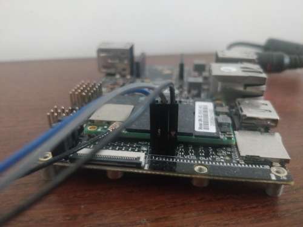
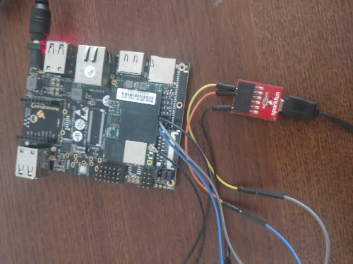

# MFX-1 Gateway
MFX-1 gateway is based on [SolidRun](https://www.solid-run.com/) boards:
- [CBi board](https://www.solid-run.com/nxp-family/hummingboard-cbi/) for ARM gateway
- [Solid PC](https://www.solid-run.com/intel-braswell-family/solidpc-q4/) for Intel gateway

## Documentation
Documentation about Solid Run HW can be found here: https://developer.solid-run.com/

In particular, information about i.MX6 SoM can be found here: https://developer.solid-run.com/products/imx6-som/

## UART
UART pins are located on the edge on the board:



They should be connected to PC via UART-to-USB cable:



More information can be found [here](https://developer.solid-run.com/knowledge-base/hummingboard-gate-edge-uart-console/).

Use [Minicom](https://en.wikipedia.org/wiki/Minicom) or other serial terminal to read UART console from the board.

Official guide can be found [here](https://developer.solid-run.com/knowledge-base/serial-connection/).

## Flashing SD card
Instructions can be found here: https://developer.solid-run.com/knowledge-base/flashing-an-sd-card/

Software can be downloaded from here: https://developer.solid-run.com/article-categories/i-mx6-software/

For SD card jumpers 3-4 and 5-6 need to be set, like explained
[here](https://developer.solid-run.com/knowledge-base/hummingboard-edge-gate-boot-jumpers/)
under `MicroSD 2 jumpers will be needed: (3+4), (5+6)` chapter.

Once you are greeted by a login prompt, the default username and password are both "debian".
For security reasons there is no root password! If you really need one, you can run `sudo passwd root` to set your own.

### Flashing eMMC from SD card
If Debian is used, instructions for flashing eMMC from SD card can be found
[here](https://developer.solid-run.com/knowledge-base/i-mx6-debian/).

Besically, WiFi has to be enabled first, Debian image then can be downloaded and `dd`-ed directly to the flash.

## WiFi
File `/etc/network/interfaces` already includes files from `/etc/network/interfaces.d` directory:

```
root@sr-imx6:~# cat /etc/network/interfaces
# interfaces(5) file used by ifup(8) and ifdown(8)
# Include files from /etc/network/interfaces.d:
source-directory /etc/network/interfaces.d
```

So we need to create file `/etc/network/interfaces.d/wlan0`:
```root@sr-imx6:~# cat /etc/network/interfaces.d/wlan0 
auto wlan0
iface wlan0 inet dhcp
        wpa-essid <name-of-wifi-network>
        wpa-psk <wifi-password>
```
or user builtin connmanctl

```
wpa_passphrase NETWORK_SSID PASS ( obtain psk passphrase )
sudo connmanctl
enable wifi
scan services
connect

```

> After creating this file a restart is needed. Hints can be found [here](https://askubuntu.com/questions/333063/restart-network-interface-after-editing-etc-network-interfaces)m but in the worst case whole gateway can be restarted.

## Avahi
### Rename host
Install Avahi:
[Avahi](https://www.avahi.org/) is mDNS/DNS-SD daemon.

Install:
```
apt install avahi-daemon
```

Now you can access the box via `sr-imx6.local` host alias:
```
ssh debian@sr-imx6.local
```

Follow [this thread](https://raspberrypi.stackexchange.com/questions/48056/how-to-login-as-root-remotely) to see how to ssh as a root.

## SFTP
Either install Filezilla or use Nautilus:
- In Nautilus window press `Ctrl + L`
- Type `sftp://sr-imx6.local`

## Docker
To install Docker, follow the instructions [here](https://docs.docker.com/install/linux/docker-ce/debian/).

Then follow [post installtion steps](https://docs.docker.com/install/linux/linux-postinstall/) to add user to `docker` group.

## 3G-4G Connection

Following [this instruction](https://www.robertlucian.com/2018/08/29/mobile-network-access-rpi/) basic steps are
```
sudo apt-get update && sudo apt-get install -y --no-install-recommends ppp
```
use scripts/pppd-creator.sh

```
sudo bash ppp-creator.sh telenor ttyUSB3
...

creating script file : /etc/chatscripts/quectel-chat-connect                                                                 creating script file : /etc/chatscripts/quectel-chat-disconnect                              
creating script file : /etc/ppp/peers/gprs 

```
then start connection

```
sudo pppd call gprs&

sudo ifconfig ppp0 //validate connection
```
